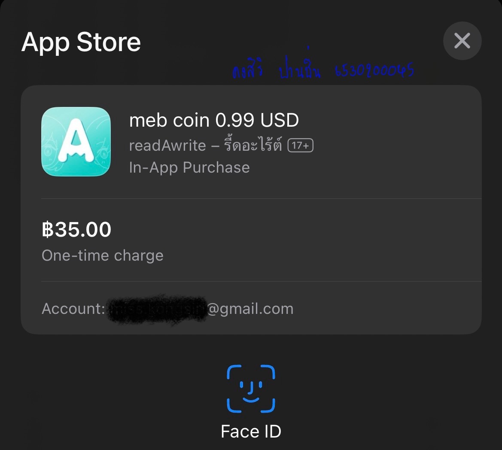
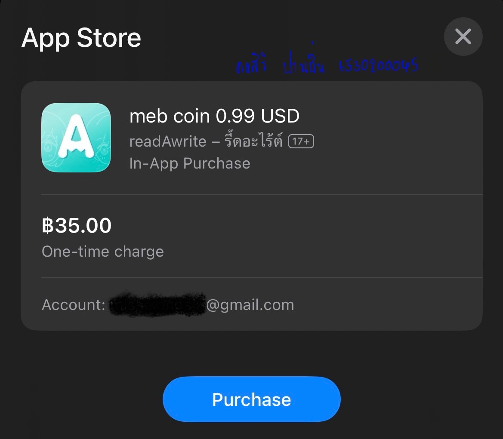
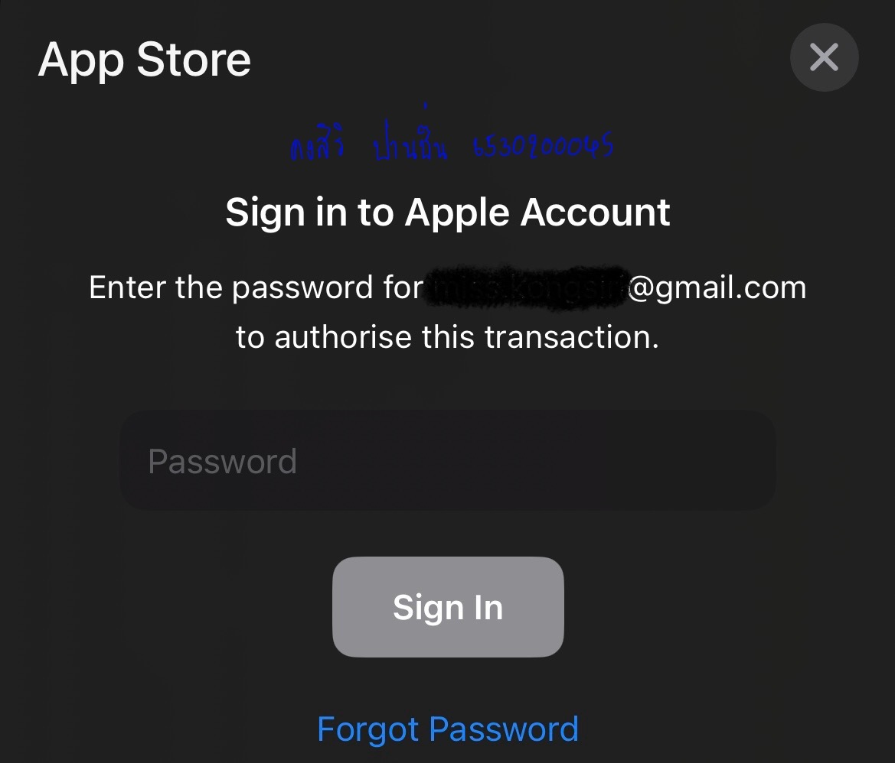

## **Security Control**

> Example of Security Controls in Daily Life

---

### Payment on App store
#### ชำระเงินผ่าน App store ในระบบ ios ของ Iphone

- Loction : My telephone (Iphone 14)

---

---

Detail : แบบแรกจะเป็นการยืนยันตัวตนผ่านการแสกนใบหน้า แต่หากเกิดข้อผิดพลาด จะต้องทำการใส่รหัสผ่านของอีเมลเพื่อเป็นการยืนยันตัวตนแทน

**Control function** : Preventative

**Type of security control** : Technical controls

-- เพราะ การชำระเงินผ่าน App store ต้องมีการยืนยันตัวตนทุกครั้งก่อนที่จะเข้าไปตรวจสอบยอดเงินในบัญชีที่ได้ผูกไว้ และหากยอดเงินในบัญชีไม่เพียงพอ ก็จะทำการปฏิเสธชำระเงินโดยทันที

---

ผู้จัดทำ นางสาว คงสิริ ปานชื่น 6530200045

[Home page](README.md)

---
